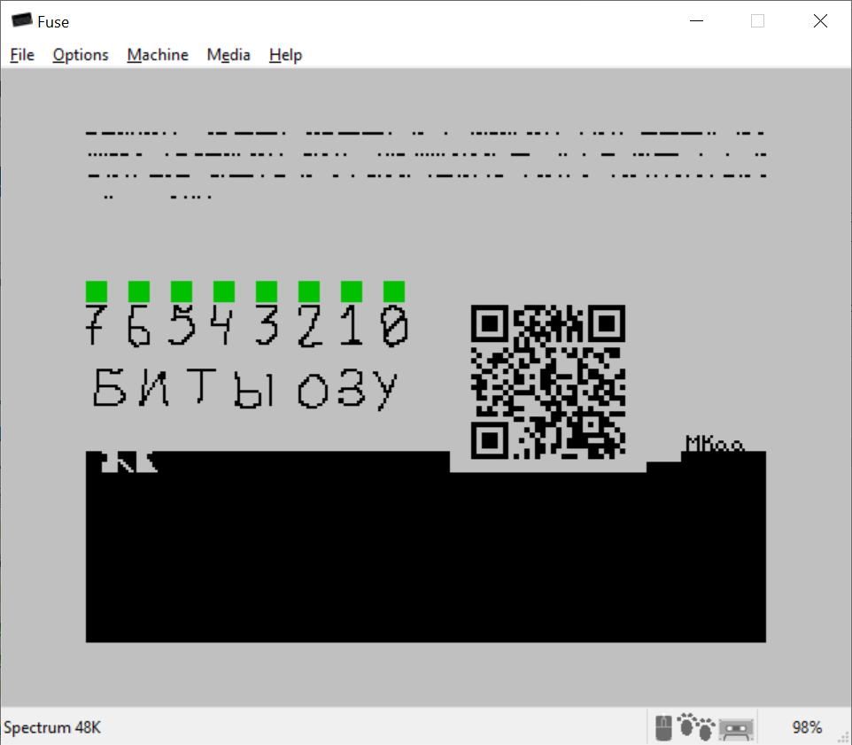

# L48RAMT
Тест оперативной памяти для компьютеров Ленинград (zx-spectrum).

# Описание

Тест расчитан на "частично работоспособные машины". Когда бейсик запускается, позволяет загрузить пленку, но игра "вылетает" или зависает.

Для работоспособности теста необходимо, чтобы корректно работало 100 ячеек памяти начиная с адреса 16384.

Тест проверяет адреса с 0x59ff по 0xffff.

Проверка производится записью паттерна с последующей его вычиткой.

Каждый цикл проверки паттерн меняется (0x00 -> 0x55 -> 0xaa -> 0xff, и так по кругу).

В случае если обнаружен сбойный бит соответствующее ему знакоместо закрашивается красным.

При старте бордер белый, когда найден сбойный бит бордер на небольшое время становится красным и после задержки синий.

# Сборка из изходного кода

Склонируйте репозитарий:

git clone https://github.com/MikhaelKaa/L48RAMT.git

Выполните в директории репозитария:

sudo ./configure

make init (уcтановит sjasmplus)

make build

собранный tap файл будет находится в ./M48RAMT/build/

# Готовый tap файл

Можно найти в разделе https://github.com/MikhaelKaa/L48RAMT/releases

# Запуск в Fuse

# Идеи и предложения принимаются.

